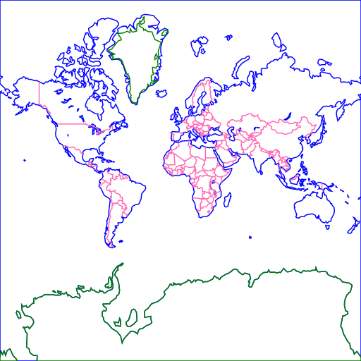
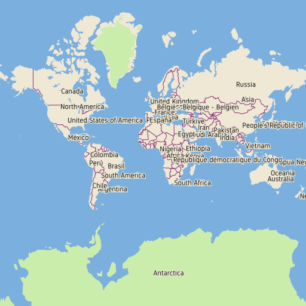
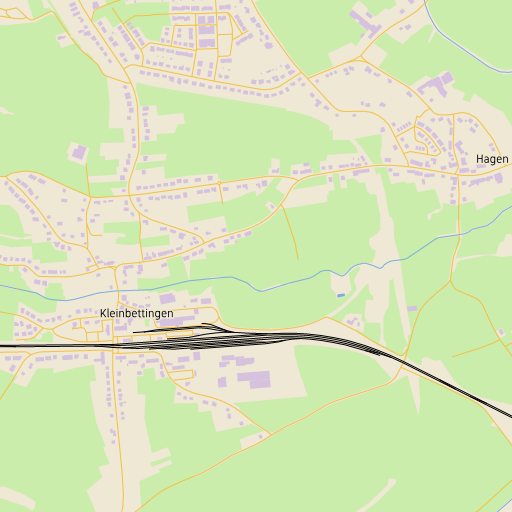
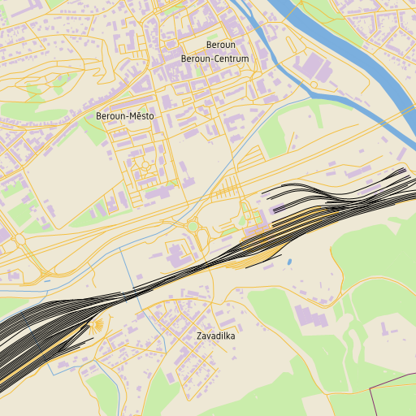
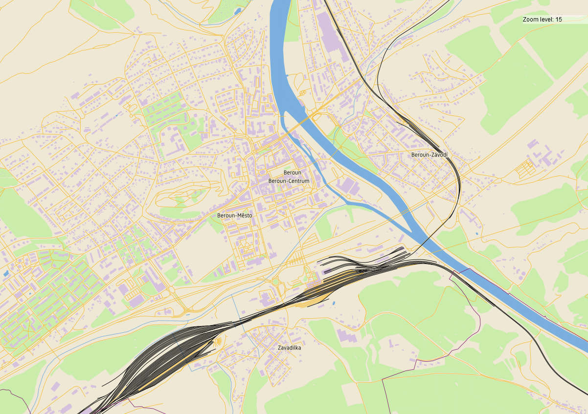

# lunarender3

experimental openstreetmap renderer - work in progress

status: I can read PBF/MVT and make some debug images using styles hardcoded in Nim.

  
More nice pictures

## idea

1. use [tilemaker](https://github.com/systemed/tilemaker) (or [planetiler](https://github.com/onthegomap/planetiler)) to make vector tiles
2. use this tool (*lunarender3*) to render map
3. profit! (or at least have map with nice colors)

I am far away from point 3, but I have some ideas:

- instead of JSON stylesheet use Lua (hence lunarender name)
- make app capable working both as localhost server and backend for public map (behind some Nginx)

## my previous work

- original [lunarender](https://github.com/severak/lunarender)
- 2018 [proof of concept](https://github.com/severak/lunatest) in Go
- [mapstyles](https://github.com/severak/mapstyles) which will be ported to this version

## data & links

- [Vector tile specification](https://github.com/mapbox/vector-tile-spec) (as we are implementing our own parser)
- [Vector tiles test suite](https://github.com/mapbox/mvt-fixtures)
- [OpenMapTiles schema](https://openmaptiles.org/schema/)
- current [test data](https://data.maptiler.com/downloads/europe/luxembourg/) (Luxembourg from OpenMapTiles)
- [MAKI icons](https://labs.mapbox.com/maki-icons/)
- https://www.axismaps.com/guide

## TODOs & ideas 

- https://github.com/mlevans/leaflet-hash and planetilers like tiles inspector
- be able to write rules in lua
- unreverse reversed y coordinate
- handle missing tiles gracefully
- handle broken tiles gracefully
- bind other interfaces to be able to host demo on server
- host pbf content for javascript clients
- cache results
- mark occupied areas to not collide text labels and icons
- draw text labels from neighbor tiles to not crop labels crossing tile borders
- make "average lines" from paths to put street names on
- derive zoom levels above 14 from zoom 14
- optimize a lot
- translate lua rules via [fengari](https://github.com/fengari-lua/fengari) for use in [Leaflet.VectorGrid](https://github.com/Leaflet/Leaflet.VectorGrid)
- https://docs.microsoft.com/en-us/bingmaps/articles/bing-maps-tile-system
- https://github.com/paulmach/orb/blob/master/maptile/tile.go